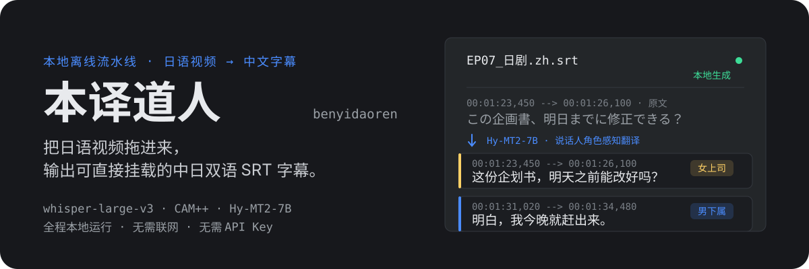
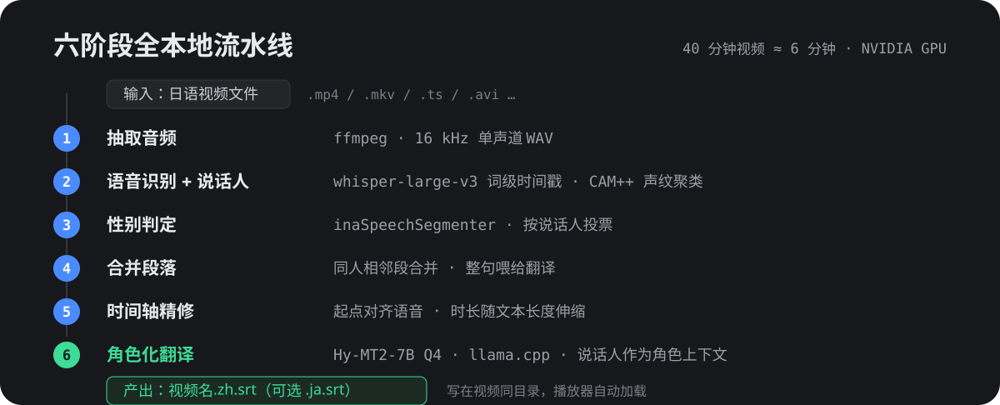

<p align="center">
  
</p>

<p align="center">
  
  &nbsp;
  
  &nbsp;
  
  &nbsp;
  
  &nbsp;
  
</p>

---

**本译道人**是一个跑在自己电脑上的日语视频转字幕工具：拖入一集日剧，它用本地大模型完成语音识别、说话人分离和翻译，在视频同目录生成可直接挂载的 `.zh.srt` 中文字幕（可选同时输出日文 `.ja.srt`）。全程不联网、不上传、无需任何 API Key。

它不只有「翻译」这一步——识别出**谁在说话**之后，会把说话人身份（如「女上司」「男下属」）作为上下文交给翻译模型，让同一句台词在不同角色口中有更贴切的措辞。

## ✨ 特性

- **全程本地离线** — ASR、声纹、性别判定、翻译四个模型全部跑在本机 GPU，视频和字幕不出电脑。
- **说话人角色感知翻译** — CAM++ 声纹聚类区分两位说话人，inaSpeechSegmenter 判定性别，翻译时注入角色上下文。
- **时间轴精修** — 起点对齐语音实际起点，展示时长随中日文本长度伸缩（2.5s–8s），而不是机械沿用 ASR 分段。
- **两种用法** — Windows 双击 GUI（拖拽排队、七阶段进度、依赖预检），或一条命令的 CLI，还有支持拖拽的 `.bat`。
- **依赖预检** — GUI 启动时自动检查 venv、三个模型与 llama-server 是否就位，缺什么直接告诉你，不等到半路报错。

## ⚙️ 工作原理

<p align="center">
  
</p>

1. **抽取音频** — ffmpeg 转出 16 kHz 单声道 WAV。
2. **语音识别 + 说话人** — faster-whisper `large-v3` 词级时间戳转写日语；CAM++ 对长段做声纹嵌入，KMeans 聚成两位说话人，锚点传播到全部短段。
3. **性别判定** — inaSpeechSegmenter 对各说话人的长段投票，得出「男声/女声」。
4. **合并段落** — 同一说话人相邻且间隔 < 2s 的段合并成整句（单句上限 7s），给翻译更完整的上下文。
5. **时间轴精修** — 按 `max(2.5s, 日文长×0.16, 中文长×0.22)` 计算展示时长，语音结束前 1s 内收尾。
6. **角色化翻译** — 本地 `llama-server` 载入 Hy-MT2-7B（Q4_K_M），按说话人角色构造提示词，4 路并发翻译；输出自动去引号、检测假名残留并重试。

## 🚀 快速开始

### 环境要求

- Windows 10/11 + WSL2（Ubuntu），NVIDIA GPU
- WSL 内：Python 3.10+、ffmpeg、[llama.cpp](https://github.com/ggml-org/llama.cpp) 的 `llama-server`

### 1. 准备 Python 环境（WSL 内）

```bash
python3 -m venv ~/venvs/subtitle-pipeline
~/venvs/subtitle-pipeline/bin/pip install faster-whisper funasr \
    inaspeechsegmenter scikit-learn av soundfile
```

### 2. 放置模型

| 用途 | 模型 | 默认路径 |
| --- | --- | --- |
| 语音识别 | faster-whisper large-v3 | `~/models/asr/whisper-large-v3` |
| 声纹说话人 | CAM++ | `~/models/asr/campplus/campplus_cn_common.bin` |
| 翻译 | Hy-MT2-7B Q4_K_M (GGUF) | `~/models/translation/hy-mt2-7b/` |

路径与 `ja2zh_subtitle.py` 顶部的常量一一对应，放在别的位置的话改那里即可。

### 3. 使用

**图形界面（推荐，Windows 侧）**：双击 `gui/benyidaoren.py`（或打包好的 exe）。把日语视频拖进窗口，点「开始转换」，七阶段进度实时可见；可继续拖入追加排队。

> GUI 壳通过 `wsl.exe` 调起宿主执行，若脚本不在 `/home/lmr/tools/ja2zh_subtitle/`，请同步修改 `gui/benyidaoren.py` 顶部的路径常量。

**命令行（WSL 内）**：

```bash
python3 ja2zh_subtitle.py "/mnt/d/Anime/EP07.mkv" --keep-ja
# 完成: /mnt/d/Anime/EP07.zh.srt
# 同时输出: /mnt/d/Anime/EP07.ja.srt
```

**拖拽批处理**：把视频文件直接拖到 `视频转中文字幕.bat` 图标上。

翻译服务无需手动启动——脚本会自动拉起 `llama-server`，端口 8888 被占时自动换随机端口，结束后自动停止。

## 🏗️ 架构：壳与宿主

本项目刻意把「界面」与「重活」拆在两个世界，Windows 侧只装轻量 GUI，所有模型和依赖留在 WSL：

| 术语 | 是什么 | 在哪里 | 职责 |
| --- | --- | --- | --- |
| **壳** | `gui/benyidaoren.py`（PySide6） | Windows | 界面、拖拽排队、进度展示、依赖预检、任务发起 |
| **宿主** | `ja2zh_subtitle.py` + venv + 模型 | WSL Ubuntu | 抽音频、ASR、说话人、性别、翻译，产出 SRT |
| **任务** | 一次「日语视频 → 中日双字幕」转换 | — | 由壳发起、宿主执行，产出写在视频同目录 |

壳与宿主之间只用 `wsl.exe` + 静态脚本传参通信，预检与执行脚本常驻 WSL 侧（`gui/host/`），避免跨边界转义的种种坑。

## ⚠️ 当前限制

- **双人对话优化** — 声纹聚类固定为两位说话人，三人以上群聊场景的分离效果会下降。
- **翻译语境** — 角色上下文按「日剧职场双人对话（女上司 × 男下属）」调优；其他题材可译，但措辞风格可能偏向该语境。
- **性别影响措辞** — 性别判定靠声学投票，误判会连带影响翻译的角色提示。
- **需要 NVIDIA GPU** — ASR 与翻译均按 CUDA 配置。

## 开发

```bash
python3 tests/ui_state_test.py
python3 tests/ui_check_retry_test.py
```
